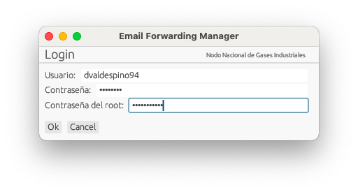
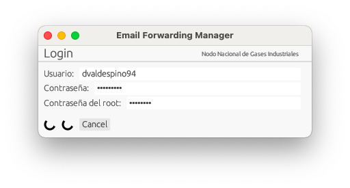
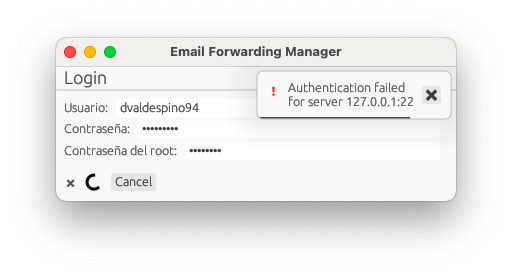
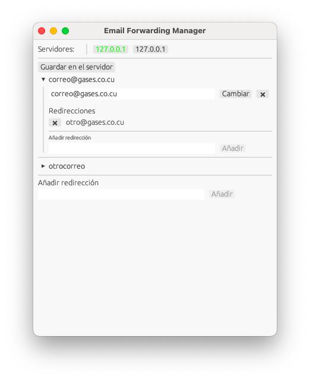
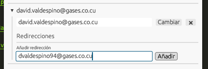
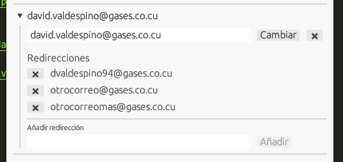
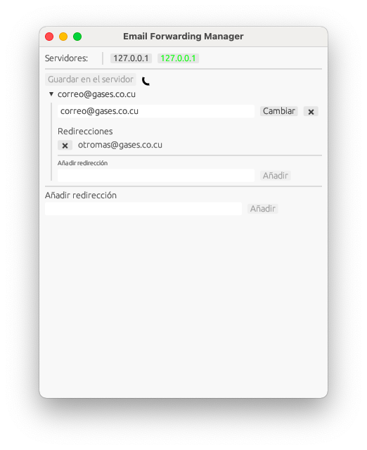
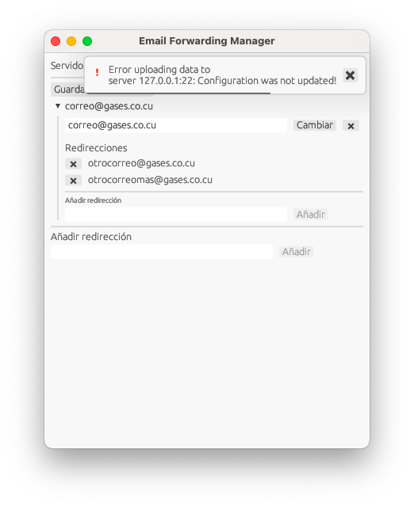

# 	Utilitario de gestión de redirecciónes

​	Este es un sencillo utilitario que permite gestionar remotamente las reglas de redirección de postfix en varios servidores simultáneamente.

### Login

​	Al introducir las contraseñas utilizadas por el sistema se activa el botón **Ok**



​	Al presionar el botón comienza el proceso de login de manera secuencial en los diferentes servidores configurados, mostrándose un *spinner* mientras está en proceso



​	En caso de fallo de la autenticación se muestra un ícono de ❌ y una noficicación con información del fallo.



### Uso de la aplicación

​	Al autenticar todos los servidores se muestra la interfaz principal. En la parte superior se muestra la lista de servidores conectados, señalando en verde el que esté seleccionado actualmente. El botón "*Guardar en el servidor*" hace exactamente eso 🙂.



### Insertar/Eliminar una redirección

​	Si necesita insertar una nueva redirección solo introduzca el correo en el cuadro de texto y presione el botón añadir


​	De esta manera queda registrado el correo, pero por defecto no tiene ningúna dirección de correo de destino para redireccionar. Para añadir una dirección de destino solo tiene que presionar sobre la dirección recien creada para desplegarla


​	Al desplegarse se muestran varios elementos, desde arriba hacia abajo se ven un cuadro de texto que permite modificar la dirección de correo introducida, (después de modificarla en el cuadro de texto presione el botón "*Cambiar*" para guardar los cambios en la aplicación). Luego de ese botón hay otro más pequeño ("*❌*") que elimina la entrada de la lista.

​	Más abajo se ve otro cuadro de texto que permite añadir direcciones de correo de destino, cuantas sea necesario, solo introduzca el correo en el cuadro y presione "*Añadir*".



​	La lista de direcciones de destino se muestra debajo de la etiqueta "*Redirecciones*", y por cada dirección de destino hay un botón que al presionarlo la elimina.



### Guardar los cambios en el servidor

​	Al presionar el botón "*Guardar en el servidor*" comienza el proceso de subida de la configuración. Mientras esto ocurre el botón es deshabilitado y aparece un *spinner* justo al lado, hasta el final del proceso.



​	Si hay algún error al actualizar la infrormación aparecerá un pequeño mensaje de error.



### Configuración

​	La configuración de la aplicación se lee de un archivo TOML (Texto plano, parecido a los .INI usados en Windows) con los siguientes campos:

> username: el nombre de usuario por defecto que se muestra en el login, ayuda a no tener que escribirlo cada vez que se abre la aplicación
>
> servers: lista de servidores que serán gestionados, es una lista de objetos, que tienen los siguientes campos:
>
> 	- addr: Dirección del servidor, puede ser directamente una IP o un nombre, la aplicación se resuelve automaticamente.
> 	- port: El puerto por el que se conectará la aplicación al servidor mediante SSH, por defecto es el puerto 22
> 	- config_path: Es el camino al archivo de usuarios virtuales de postfix, que es el que contiene la configuración

```toml
username = "wmiuser"
servers = [
    { addr = "pop3.gases.co.cu", port = 22, config_path = "/etc/postfix/virtualuser" },
    { addr = "smtp.gases.co.cu", port = 22, config_path = "/etc/postfix/virtual" },
]

```

​	**Nota:** Después de subir la configuración al servidor la aplicación intenta ejecutar el siguiente script `/etc/postfix/post_update` para recargar la configuración en postfix y dovecot. No hay ningun problema si el script no existe, pero se tendría que recargar la configuración manualmente.